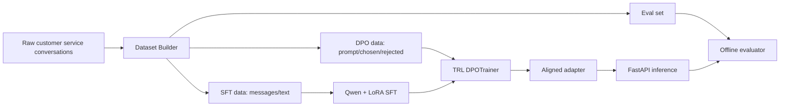

# Qwen DPO Customer Service Alignment

面向电商客服多轮对话场景的 **SFT + DPO 偏好对齐** 项目。项目提供从原始客服样本、SFT 指令微调数据、DPO chosen/rejected 偏好对、离线评估到 FastAPI 推理服务的完整链路。

这个仓库的目标不是堆一个训练脚本，而是把简历里“Qwen 指令微调 + LoRA/QLoRA + DPO 偏好对齐 + 离线评估”的项目做成可检查、可运行、可面试复盘的工程闭环。

## 项目亮点

- **数据构建**：将电商客服多轮对话清洗为 SFT `messages/text` 与 DPO `prompt/chosen/rejected` 偏好对。
- **SFT 微调**：基于 Qwen 系列模型与 LoRA/QLoRA 思路完成客服场景监督微调。
- **DPO 对齐**：通过 chosen/rejected 偏好对约束回复风格，降低机械回复、不合规回复和拒答不稳定问题。
- **评估闭环**：提供人工偏好胜率、无效回复率、拒答准确率、关键词召回等离线评估指标。
- **工程落地**：提供 FastAPI 推理接口；未安装大模型依赖时可用规则模型跑通 API 与评估链路。

## 架构



## 快速开始

### 1. 创建环境

```powershell
cd D:\桌面\面试\qwen-dpo-customer-service
uv sync
```

### 2. 构建 SFT / DPO / Eval 数据

```powershell
uv run python -m qwen_dpo_cs.build_dataset `
  --input data/raw/customer_service_seed.jsonl `
  --out-dir data/processed
```

输出：

- `data/processed/sft_train.jsonl`
- `data/processed/dpo_train.jsonl`
- `data/processed/eval.jsonl`
- `data/processed/dataset_report.md`

### 3. 跑离线评估 smoke test

这个命令不需要下载大模型，会使用内置规则客服模型验证评估链路。

```powershell
uv run python -m qwen_dpo_cs.evaluation `
  --eval-file data/processed/eval.jsonl `
  --prediction-out output/eval/rule_predictions.jsonl `
  --metrics-out output/eval/metrics.json
```

示例指标：

```json
{
  "total": 8,
  "avg_quality_score": 3.55,
  "avg_keyword_recall": 0.792,
  "invalid_response_rate": 0.0,
  "refusal_accuracy": 1.0,
  "preference_pair_accuracy": 1.0
}
```

## 真实训练

训练依赖较重，建议有 GPU 后再安装：

```powershell
uv sync --extra train
```

### SFT

```powershell
uv run python -m qwen_dpo_cs.training.sft_train `
  --model-name Qwen/Qwen2.5-0.5B-Instruct `
  --train-file data/processed/sft_train.jsonl `
  --output-dir checkpoints/sft-lora `
  --epochs 1 `
  --batch-size 1 `
  --grad-accum 8
```

### DPO

```powershell
uv run python -m qwen_dpo_cs.training.dpo_train `
  --model-name Qwen/Qwen2.5-0.5B-Instruct `
  --sft-adapter checkpoints/sft-lora `
  --train-file data/processed/dpo_train.jsonl `
  --output-dir checkpoints/dpo-lora `
  --beta 0.1 `
  --epochs 1 `
  --batch-size 1 `
  --grad-accum 8
```

> 本仓库默认使用小规模样例数据保证流程可复现。真实项目中应扩充多轮客服数据、拒答边界样本、售后场景样本，并将评估集与训练集隔离。

## API 服务

安装 API 依赖：

```powershell
uv sync --extra api
```

默认规则模型启动：

```powershell
uv run uvicorn qwen_dpo_cs.api:app --host 127.0.0.1 --port 8000
```

调用：

```powershell
curl -X POST http://127.0.0.1:8000/chat `
  -H "Content-Type: application/json" `
  -d "{\"messages\":[\"我这个衣服刚收到不想要了，可以退吗？包装还在。\"]}"
```

如果已有训练后的模型或 LoRA adapter：

```powershell
$env:MODEL_PATH="Qwen/Qwen2.5-0.5B-Instruct"
$env:ADAPTER_PATH="checkpoints/dpo-lora"
uv run uvicorn qwen_dpo_cs.api:app --host 127.0.0.1 --port 8000
```

## 数据格式

原始数据为 JSONL，每行一个样本：

```json
{
  "id": "refund_001",
  "category": "refund",
  "user_messages": ["我这个衣服刚收到不想要了，可以退吗？包装还在。"],
  "chosen": "理解你的情况。如果商品不影响二次销售...",
  "rejected": "可以退，直接点退款就行，不行就找商家。",
  "expected_keywords": ["订单号", "七天", "退货退款"],
  "refusal_expected": false
}
```

## 评估指标

- `invalid_response_rate`：短回复、敷衍回复、明显无效回复比例。
- `refusal_accuracy`：需要拒答时是否明确边界，不需要拒答时是否避免过度拒绝。
- `preference_pair_accuracy`：规则评估器是否能给 chosen 高于 rejected 的分数，用于检查偏好数据质量。
- `avg_keyword_recall`：回复是否覆盖场景关键字段，如订单号、退货退款、隐私、平台规则等。

## 适合写进简历的版本

> 基于 Qwen 与 DPO 的电商客服回复偏好对齐系统：构建客服多轮对话 SFT 数据与 chosen/rejected 偏好对，基于 LoRA/QLoRA 完成 Qwen 指令微调，并使用 TRL DPOTrainer 进行偏好优化；从人工偏好胜率、无效回复率、拒答准确率、多轮一致性等维度搭建离线评估，形成数据构建、训练、评估与 badcase 回流闭环。

## 目录结构

```text
qwen-dpo-customer-service/
├── configs/train.yaml
├── data/raw/customer_service_seed.jsonl
├── src/qwen_dpo_cs/
│   ├── build_dataset.py
│   ├── evaluation.py
│   ├── inference.py
│   ├── api.py
│   └── training/
│       ├── sft_train.py
│       └── dpo_train.py
├── tests/
└── docs/
```

## 注意

- 样例数据用于复现流程，不代表真实业务数据。
- 如果写简历，建议只写“构建/实现/评估链路”，不要写成大规模生产训练。
- 真实训练建议至少准备独立验证集，并记录训练参数、adapter 版本和 badcase 迭代记录。
