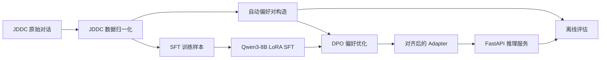

# Qwen3-8B 电商客服偏好对齐系统

本项目面向中文电商客服多轮对话场景，基于 JDDC/JDDC-style 客服对话数据构建 SFT 数据与 DPO 偏好对，并使用 Qwen3-8B、LoRA/QLoRA、TRL 完成监督微调和偏好优化。

项目重点覆盖数据清洗、自动偏好数据构造、SFT、DPO、离线评估与 FastAPI 推理服务，形成一套可复现的客服回复对齐训练流程。

## 项目概览

整体流程包含四个部分：

- 将 JDDC/JDDC-style 电商客服多轮对话归一化为 `system/user/assistant` 消息格式。
- 基于真实客服回复构造 SFT 监督微调样本。
- 使用弱监督规则自动构造 DPO 的 `chosen/rejected` 偏好对。
- 基于 Qwen3-8B 训练 LoRA adapter，并评估回复质量、拒答边界和偏好对一致性。



## 数据集

仓库不直接分发 JDDC 原始数据。请从官方数据源或公开项目获取 JDDC/JDDC 2.1 数据，并将解压后的文件放到：

```text
data/jddc/raw/
```

数据转换器支持常见 JSON/JSONL 对话格式，包括：

- `messages: [{"role": "user", "content": "..."}, ...]`
- `dialogue`、`dialog`、`turns`、`utterances`、`conversation`、`session`
- 单轮 `query/response` 记录

相关资料：

- [JDDC](https://aclanthology.org/2020.lrec-1.58/)：大规模中文电商客服多轮对话数据集，论文报告包含 100 万级多轮对话。
- [JDDC 2.1](https://github.com/hrlinlp/jddc2.1)：中文电商多模态对话数据集，覆盖查询改写、回复生成、篇章解析和摘要等任务。
- [Qwen3-8B](https://huggingface.co/Qwen/Qwen3-8B)：Qwen3 系列 8.2B 参数模型。

## 环境准备

基础环境：

```powershell
uv sync
```

训练依赖：

```powershell
uv sync --extra train
```

API 依赖：

```powershell
uv sync --extra api
```

## 数据处理

将 JDDC-style 原始对话转换为偏好对记录：

```powershell
uv run python -m qwen_dpo_cs.jddc `
  --input data/jddc/raw `
  --out-file data/processed/preference_pairs.jsonl `
  --max-dialogues 50000
```

生成 SFT、DPO 与评估数据：

```powershell
uv run python -m qwen_dpo_cs.build_dataset `
  --input data/processed/preference_pairs.jsonl `
  --out-dir data/processed
```

输出文件：

```text
data/processed/sft_train.jsonl
data/processed/dpo_train.jsonl
data/processed/eval.jsonl
data/processed/dataset_report.md
```

## 自动偏好对构造

项目将真实客服回复作为 `chosen`，并通过可控负样本策略自动生成 `rejected`：

- `terse`：回复过短，缺少必要流程说明。
- `vague`：表达模糊，把问题推回给用户，没有可执行方案。
- `overpromise`：无依据承诺退款、赔偿或处理结果。
- `privacy_leak`：涉及手机号、身份证、验证码等隐私或安全边界时给出不合规回复。

这种方式可以批量构造 DPO 偏好数据，同时让负样本来源保持可解释、可审计。生成记录会包含 `source`、`category`、`expected_keywords`、`refusal_expected` 等字段，方便后续过滤和评估。

## SFT 训练

```powershell
uv run python -m qwen_dpo_cs.training.sft_train `
  --model-name Qwen/Qwen3-8B `
  --train-file data/processed/sft_train.jsonl `
  --output-dir checkpoints/sft-lora `
  --epochs 1 `
  --batch-size 1 `
  --grad-accum 8
```

## DPO 偏好优化

```powershell
uv run python -m qwen_dpo_cs.training.dpo_train `
  --model-name Qwen/Qwen3-8B `
  --sft-adapter checkpoints/sft-lora `
  --train-file data/processed/dpo_train.jsonl `
  --output-dir checkpoints/dpo-lora `
  --beta 0.1 `
  --epochs 1 `
  --batch-size 1 `
  --grad-accum 8
```

## 离线评估

```powershell
uv run python -m qwen_dpo_cs.evaluation `
  --eval-file data/processed/eval.jsonl `
  --prediction-out output/eval/predictions.jsonl `
  --metrics-out output/eval/metrics.json
```

评估指标：

- `invalid_response_rate`：空回复、敷衍回复、无帮助回复比例。
- `refusal_accuracy`：隐私/安全场景是否正确拒答，普通客服场景是否避免过度拒答。
- `preference_pair_accuracy`：`chosen` 回复得分是否高于 `rejected` 回复。
- `avg_keyword_recall`：订单号、物流单号、退款、平台边界等关键客服字段覆盖情况。

## API 服务

```powershell
uv sync --extra api
$env:MODEL_PATH="Qwen/Qwen3-8B"
$env:ADAPTER_PATH="checkpoints/dpo-lora"
uv run uvicorn qwen_dpo_cs.api:app --host 127.0.0.1 --port 8000
```

如果不设置 `MODEL_PATH`，服务会使用内置规则回复器，便于进行接口连通性测试。

```powershell
curl -X POST http://127.0.0.1:8000/chat `
  -H "Content-Type: application/json" `
  -d "{\"messages\":[\"我这个衣服刚收到不想要了，可以退吗？包装还在。\"]}"
```

## 目录结构

```text
configs/train.yaml
data/jddc/.gitkeep
src/qwen_dpo_cs/jddc.py
src/qwen_dpo_cs/build_dataset.py
src/qwen_dpo_cs/training/sft_train.py
src/qwen_dpo_cs/training/dpo_train.py
src/qwen_dpo_cs/evaluation.py
src/qwen_dpo_cs/api.py
tests/fixtures/jddc_sample.jsonl
```

## 开发检查

```powershell
uv run python -m qwen_dpo_cs.jddc --input tests/fixtures/jddc_sample.jsonl --out-file data/processed/preference_pairs.jsonl
uv run python -m qwen_dpo_cs.build_dataset --input data/processed/preference_pairs.jsonl --out-dir data/processed
uv run python -m qwen_dpo_cs.evaluation --eval-file data/processed/eval.jsonl --prediction-out output/eval/predictions.jsonl --metrics-out output/eval/metrics.json
uv run python -m unittest discover -s tests
```
