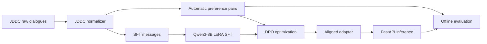

# Qwen3-8B Customer Service Preference Alignment

Qwen3-8B customer service alignment pipeline for Chinese e-commerce dialogue. The project converts JDDC-style multi-turn customer service conversations into supervised fine-tuning data and automatically constructed preference pairs, then runs LoRA/QLoRA SFT and DPO preference optimization with TRL.

## Overview

The pipeline focuses on four tasks:

- Normalize JDDC/JDDC-style e-commerce customer service dialogues into `system/user/assistant` messages.
- Build SFT samples from human customer service replies.
- Construct DPO `chosen/rejected` pairs automatically with weak-supervision rules and controlled negative responses.
- Train Qwen3-8B adapters and evaluate customer service quality, refusal boundaries, and preference-pair consistency.



## Dataset

This repository does not redistribute JDDC data. Download JDDC/JDDC 2.1 from the official source or dataset project and place the extracted files under:

```text
data/jddc/raw/
```

The converter accepts common JSON/JSONL dialogue layouts, including:

- `messages: [{"role": "user", "content": "..."}, ...]`
- `dialogue/dialog/turns/utterances/conversation/session`
- single-turn `query/response` records

References:

- JDDC: large-scale Chinese e-commerce customer service dialogue corpus, with more than 1M multi-turn dialogues reported in the paper.
- JDDC 2.1: multimodal Chinese e-commerce dialogue dataset with query rewriting, response generation, discourse parsing, and summarization tasks.
- Qwen3-8B: 8.2B-parameter Qwen3 model.

## Environment

```powershell
uv sync
```

Training dependencies are optional:

```powershell
uv sync --extra train
```

API dependencies are optional:

```powershell
uv sync --extra api
```

## Data Preparation

Convert JDDC-style dialogues into preference-pair records:

```powershell
uv run python -m qwen_dpo_cs.jddc `
  --input data/jddc/raw `
  --out-file data/processed/preference_pairs.jsonl `
  --max-dialogues 50000
```

Build training and evaluation files:

```powershell
uv run python -m qwen_dpo_cs.build_dataset `
  --input data/processed/preference_pairs.jsonl `
  --out-dir data/processed
```

Generated files:

```text
data/processed/sft_train.jsonl
data/processed/dpo_train.jsonl
data/processed/eval.jsonl
data/processed/dataset_report.md
```

## Automatic Preference Construction

Human customer service responses are used as `chosen`. Rejected responses are generated with controlled negative strategies:

- terse response: short and under-specified
- vague response: pushes the user away without actionable guidance
- overpromise response: makes unsupported refund/compensation commitments
- privacy-leak response: violates privacy or platform safety boundaries

This produces scalable weak-supervision DPO data while keeping preference errors inspectable. The generated records include `source`, `category`, `expected_keywords`, and `refusal_expected` fields for later filtering and evaluation.

## SFT

```powershell
uv run python -m qwen_dpo_cs.training.sft_train `
  --model-name Qwen/Qwen3-8B `
  --train-file data/processed/sft_train.jsonl `
  --output-dir checkpoints/sft-lora `
  --epochs 1 `
  --batch-size 1 `
  --grad-accum 8
```

## DPO

```powershell
uv run python -m qwen_dpo_cs.training.dpo_train `
  --model-name Qwen/Qwen3-8B `
  --sft-adapter checkpoints/sft-lora `
  --train-file data/processed/dpo_train.jsonl `
  --output-dir checkpoints/dpo-lora `
  --beta 0.1 `
  --epochs 1 `
  --batch-size 1 `
  --grad-accum 8
```

## Evaluation

```powershell
uv run python -m qwen_dpo_cs.evaluation `
  --eval-file data/processed/eval.jsonl `
  --prediction-out output/eval/predictions.jsonl `
  --metrics-out output/eval/metrics.json
```

Metrics:

- `invalid_response_rate`: empty, dismissive, or unhelpful response rate
- `refusal_accuracy`: whether privacy/safety cases are refused and normal service cases are not over-refused
- `preference_pair_accuracy`: whether chosen replies score higher than rejected replies
- `avg_keyword_recall`: coverage of key service fields such as order ID, logistics ID, refund, and platform boundary terms

## API

```powershell
uv sync --extra api
$env:MODEL_PATH="Qwen/Qwen3-8B"
$env:ADAPTER_PATH="checkpoints/dpo-lora"
uv run uvicorn qwen_dpo_cs.api:app --host 127.0.0.1 --port 8000
```

Without `MODEL_PATH`, the API falls back to a rule-based responder for endpoint tests.

```powershell
curl -X POST http://127.0.0.1:8000/chat `
  -H "Content-Type: application/json" `
  -d "{\"messages\":[\"我这个衣服刚收到不想要了，可以退吗？包装还在。\"]}"
```

## Repository Layout

```text
configs/train.yaml
data/jddc/.gitkeep
src/qwen_dpo_cs/jddc.py
src/qwen_dpo_cs/build_dataset.py
src/qwen_dpo_cs/training/sft_train.py
src/qwen_dpo_cs/training/dpo_train.py
src/qwen_dpo_cs/evaluation.py
src/qwen_dpo_cs/api.py
tests/fixtures/jddc_sample.jsonl
```

## Development Checks

```powershell
uv run python -m qwen_dpo_cs.jddc --input tests/fixtures/jddc_sample.jsonl --out-file data/processed/preference_pairs.jsonl
uv run python -m qwen_dpo_cs.build_dataset --input data/processed/preference_pairs.jsonl --out-dir data/processed
uv run python -m qwen_dpo_cs.evaluation --eval-file data/processed/eval.jsonl --prediction-out output/eval/predictions.jsonl --metrics-out output/eval/metrics.json
uv run python -m unittest discover -s tests
```
